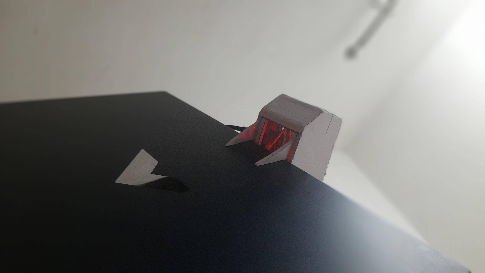
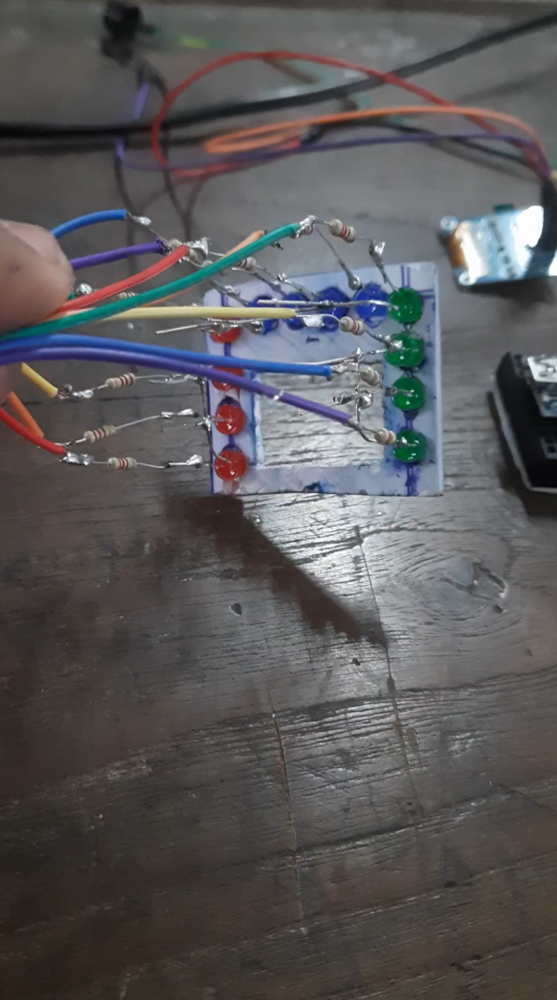
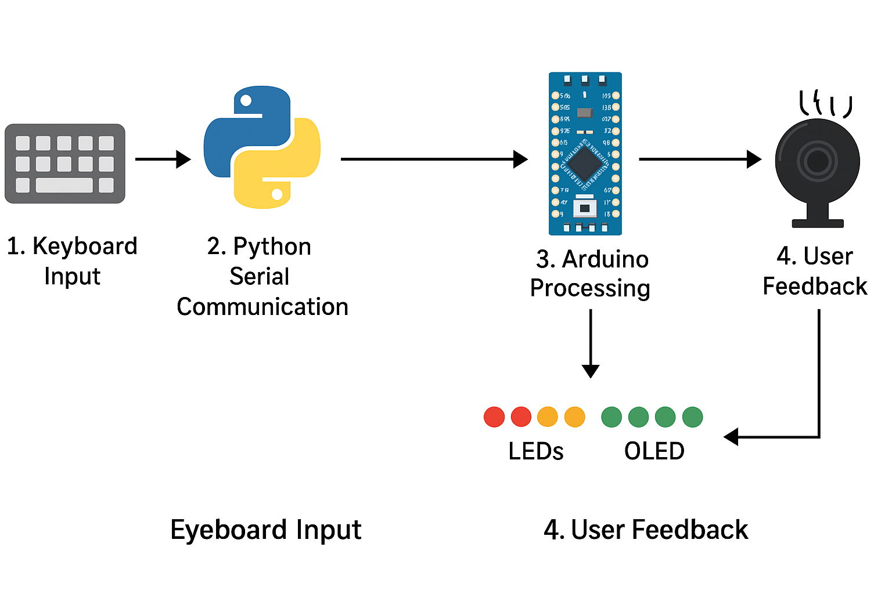
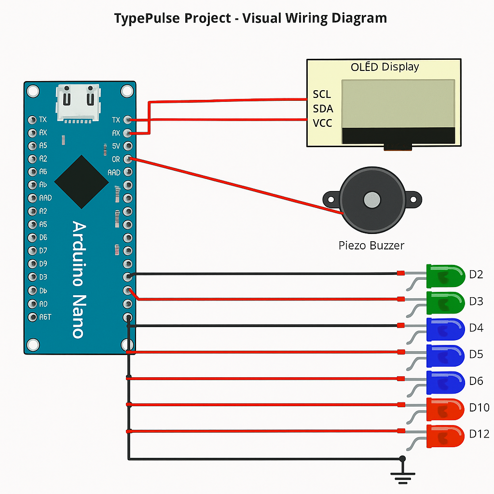
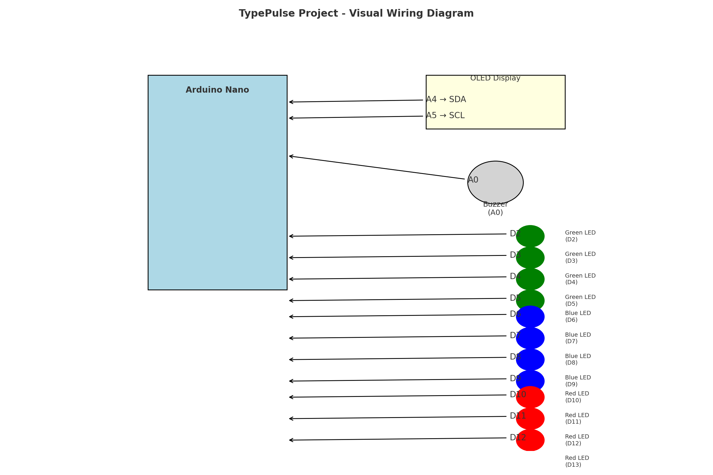
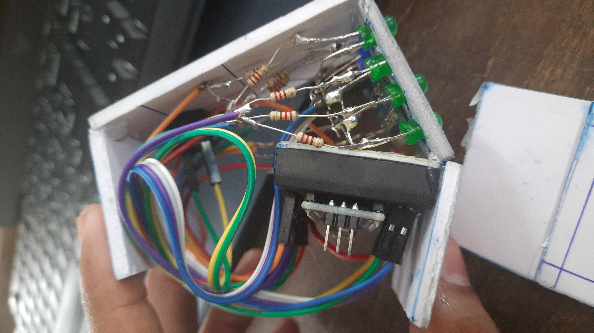
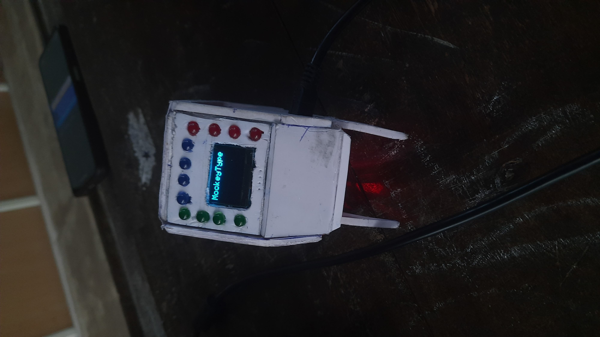

# [MockeyType] 🎯

## Basic Details
### Team Name: [MockeyType]

### Team Members
- Team Lead: [Jalvin Jomy A] - [College of engineering Trivandrum]

### Project Description
[MockeyType is a savage typing companion that reacts to your typing speed with LEDs, OLED emojis, buzzer beeps, and brutal insults. The slower you type, the more it mocks you — motivation through humiliation.]

### The Problem (that doesn't exist)
[Slow typists aren’t shamed enough for their lack of keyboard speed. They desperately need a constant reminder that their typing is painfully slow.]

### The Solution (that nobody asked for)
[An Arduino-powered mock machine that takes your typing speed from a Python script and responds with lights, sounds, and insults. Gentle motivation? Nah — we believe in maximum roast.]

## Technical Details
### Technologies/Components Used
**For Software:**
- **Languages:** Python, C++ (Arduino)
- **Libraries:**
  - Python: `pyserial`
  - Arduino: `Wire.h`, `Adafruit_GFX.h`, `Adafruit_SSD1306.h`
- **Tools:** Arduino IDE, Python environment

**For Hardware:**
- Arduino Nano
- 12 × 5mm LEDs (pins D2–D13)
- OLED Display (I2C)
- Passive Buzzer (pin A0)
- Breadboard & jumper wires
- USB cable for Arduino
- Body modelling, Soldering, and other basic tools

### Implementation
**For Software:**

#### Installation
-pyserial

# Run
# Upload Arduino code to Nano
# Then run Python script
python mockeytype.py

### Project Documentation
For Software:

# Screenshots (Add at least 3)

*OLED screen displaying a savage roast with an angry emoji when typing speed is low*

*Perfection in design of the body and stablity in lap*

*Image showing how complex the soldering circuit of leds are!*

# Diagrams

*Keyboard input → Python calculates WPM → Data sent to Arduino → LEDs/OLED/Buzzer react based on speed ranges*

---

For Hardware:

# Schematic & Circuit

*Shows pin connections: D2–D13 for LEDs, SDA/SCL for OLED, A0 for buzzer, common GND, and 5V power supply*

*Formal wiring diagram matching actual circuit layout*

# Build Photos

*Arduino Nano, 12 × 5mm LEDs, OLED display, passive buzzer, breadboard, jumper wires, USB cable*

*Assembly process: connecting LEDs to D2–D13, attaching OLED via I2C pins, and wiring buzzer to A0*

*Final compact build — LEDs, OLED, and buzzer enclosed neatly, ready for roasting action*

---

### Project Demo
# Video
[https://drive.google.com/file/d/1sqPgfm1HarsrhRRAb99FK10BfzZYanC3/view?usp=drive_link]
*This is my project working video. It creates response from the typing. It mocks and roasts you through phrases through the oled screen with emojis and also meme roast sounds. Annoys you with bright lights too*

## Team Contributions
- **Jalvin Jomy A**: Concept, hardware design, Arduino coding, Python script development, wiring & assembly, Malayalam roast phrase integration, testing, and final build.

---
Made with ❤️ at TinkerHub Useless Projects 

